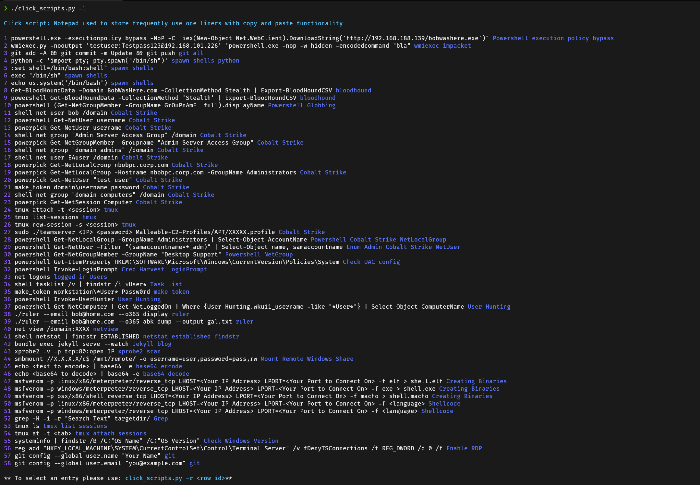

## One_liner_database Script

A copy and past notepad clickScript python tool to try and group and keep track of useful one liners with copy and paste functionality.

Code is still a work in progress and there may be some issues or errors.

## New Updates 

 * Backup basic backup functionality completed :)

## Screenshots

## Usage
----

    python click_scripts.py -h
    usage: click_scripts.py [-h] [-s SEARCH] [-i INS] [-r ROW] [-t TAGS] [-l] [-d DELETE] [-R] [-b]
    optional arguments:
        
    * -h,         --help                Show this help message and exit
    * -s SEARCH,  --search  SEARCH      Search all command relating to search term
    * -i INS,     --ins     INS         Insert always requires the tags switch (-t)
    * -r ROW,     --row     ROW         Use row to Select can copy your option to clipboard
    * -t TAGS,    --tag     TAGS        Are always used with the Insert command
    * -l LIST,    --list    LIST        List all entries in db : usage -l ALL
    * -d DELETE,  --delete  DELETE      Used to delete a single entry in the Database
    * -R Reset,   --reset   RESET       Used to delete info to Database
    * -b Backup   --backup  BACKUP      Used to make a backup of the DatabaseB

  
## To Do...

  * ~~Complete backup functionality~~
  * Add update db function from git.
  * Build telegram bot front-end ## Added telegram requirements.
  * Custom Django front end in progress.

